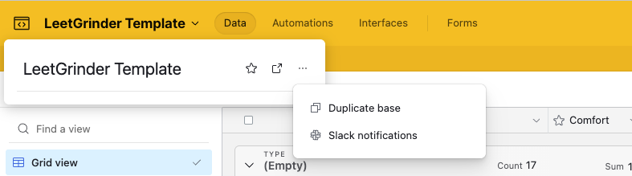

# LeetGrinder

A Chrome extension to help you track and improve your LeetCode problem-solving skills.


## Roadmap

- [ ] Update airtable template to include Blind 75 questions
- [ ] Submit to Chrome Web Store
- [ ] Add a ability to auto add Companies
- [ ] Add a ability to auto add problem types

## Installation

### From GitHub Releases (Recommended)

1. Go to the [Releases](https://github.com/yourusername/leetgrinder/releases) page
2. Download the latest `leetgrinder.zip` file
3. Extract the zip file to a folder on your computer
4. Open Chrome and go to `chrome://extensions/`
5. Enable "Developer mode" in the top right
6. Click "Load unpacked" and select the extracted folder

**‼️‼️‼️ Requires an Airtable account with the following base ‼️‼️‼️:**

[You can create a new base with the following template](https://airtable.com/invite/l?inviteId=invmvNQDujNPrxpxb&inviteToken=e819c6afcd9516e4304ffb71fa14027ebd3bd882c499e45ed8f0e0906512b876&utm_medium=email&utm_source=product_team&utm_content=transactional-alerts)

Select the "Duplicate base" option.




Then you'll want to create a new access token with the following permissions:

- **Data access permissions**: Make sure to grant the following permissions to your token:
  - data.records:read
  - data.records:write


Click the gear ⚙️ icon in LeetGrinder extension and paste your key in the `Airtable API Key` field.
Along with your base ID in the `Airtable Base ID` field.

You can find your base ID in the URL of your base. For example:

```
airtable.com/{YOUR_BASE_ID_IS_HERE}/{IGNORE_TABLE_ID}
```

## Development Installation

1. Clone the repository:

   ```bash
   git clone https://github.com/whoisdominic/leetgrinder.git
   cd leetgrinder
   ```

2. Install dependencies:

   ```bash
   yarn install
   ```

3. Build the extension:

   ```bash
   yarn build
   ```

4. Load the extension in Chrome:
   - Open Chrome and go to `chrome://extensions/`
   - Enable "Developer mode" in the top right
   - Click "Load unpacked" and select the `dist` folder

## Features

- Track your progress on LeetCode problems
- Rate your comfort level with each problem
- Get personalized problem recommendations
- Sync your data with Airtable

## How to use

COMING SOON

## Development

- `yarn dev` - Start development server
- `yarn build` - Build for production
- `yarn test` - Run tests

## License

MIT
